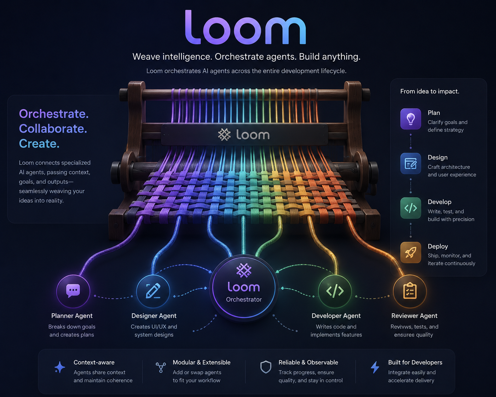

# Loom



AI-driven SDLC framework for Claude Code. One plugin, any project.

Loom weaves agents into declarative workflows driven by ticket type.
You write a config file. Loom handles the rest — planning, implementation,
review gates, feedback loops.

## Installation

Add the marketplace and install the plugin (one-time setup):

```bash
claude plugin marketplace add vbraut/loom    # from GitHub
claude plugin install loom
```

For local development, use a local path instead:

```bash
claude plugin marketplace add ~/dev/loom     # from local clone
claude plugin install loom
```

## Project setup

1. Create `sdlc.config.yml` in your project root:
   ```yaml
   version: 1
   project:
     backlog_cwd: /absolute/path/to/my-project-backlog
     context:
       brand_voice: docs/brand/copy/brand-context.md
       design_system: src/app.css
   ```

2. Configure the Backlog.md MCP server in `.mcp.json`:
   ```json
   {
     "mcpServers": {
       "backlog": {
         "command": "backlog",
         "args": ["mcp", "start", "--cwd", "/absolute/path/to/my-project-backlog"]
       }
     }
   }
   ```

3. Add `.loom/` to your project's `.gitignore`.

4. Ensure tickets have a `type:` label (e.g., `type:code-fix`). Loom routes each ticket to its matching playbook.

5. Optionally add a `rigor:` label (`rigor:light`, `rigor:standard`, `rigor:full` — default standard). Light trims assessment agents, skips elicitation, and runs smaller reviewer panels; full enables everything including the adversarial plan reviewer.

## Usage

```
/loom:work           # pick up next ticket from todo queue
/loom:work BL-042    # work on a specific ticket
/loom:review         # review next ticket at review gate
```

## How it works

```
backlog → todo → active → review → done
            ↑                │
            └────────────────┘  (rejection)
```

Human curates backlog → todo. The orchestrator picks from todo,
matches the ticket type to a playbook, and executes it.
One ticket = one type = one playbook. Complex features span
multiple tickets chained via successor creation.
Agents do the work. Humans approve at review gates.
Failed runs resume: the orchestrator tracks per-step progress, so a
re-claimed ticket continues from the first incomplete step instead of
re-running the whole pipeline.

## Concepts

- **Agents** — single-purpose subagents, both doers and reviewers (e.g., implement, requirements-reviewer, persona-reviewer)
- **Personas** — domain expert profiles (PM, UX, Security, Data, etc.) injected into the parameterized persona-reviewer agent for domain-specific assessment
- **Orchestrator** — glue between backlog, git, and playbooks: picks tickets, manages worktrees, executes the right playbook, transitions state
- **Playbook** — the authority on what happens for a ticket type: which agents to invoke, in what order, with what context. Supports conditional steps via `**When:**` fields
- **Rigor** — per-ticket depth control via the `rigor:` label (light / standard / full). Scales the assessment panel, elicitation, and convergence reviewer sets without changing the pipeline shape

## Ticket types

| Type | Description | Status |
|------|-------------|--------|
| code-fix | Bug investigation + fix | Done |
| product-definition | PRD + mocks with elevated quality review | Done |
| implementation | Implementation plan + code from a PRD or spec | Done |
| market-strategy | Market strategy, positioning, competitive analysis | Done |
| brand-exploration | Visual system — palette, typography, logos | Done |
| copy-deck | Messaging, tone of voice, copy decks | Done |

## Playbook pipelines

Each ticket type maps to a playbook — a declarative step sequence the orchestrator executes autonomously. Three mechanisms recur across playbooks:

### Assessment pipeline

Shared by all work playbooks. Prevents anchoring bias through independent assessment, then enables genuine debate through real agent-to-agent cross-talk.

```
  INDEPENDENT ASSESSMENT            CROSS-TALK                 SYNTHESIS
  ┌────────────────────────┐   ┌────────────────────────┐   ┌──────────────────┐
  │                        │   │                        │   │                  │
  │  5 cognitive agents    │   │  Each agent receives   │   │  assess-         │
  │  + N persona reviewers │──▶│  all others' findings  │──▶│  synthesizer     │
  │                        │   │  via SendMessage.      │   │                  │
  │  All assess in parallel│   │  Updates position.     │   │  Compiles the    │
  │  with no cross-talk.   │   │  Repeats until no      │   │  converged       │
  │  Named for SendMessage.│   │  Critical/High remain  │   │  positions into  │
  │                        │   │  or max rounds (3).    │   │  one approach.   │
  └────────────────────────┘   └────────────────────────┘   └──────────────────┘
```

Cognitive agents apply method diversity (DMAD): inversion, decomposition, analogy, dependency mapping, naive questioning. Persona reviewers apply domain expertise: PM always; Dev always for code playbooks, dynamic for non-code playbooks; plus 1-3 selected dynamically from the [persona pool](#personas).

Cross-talk is skipped entirely when no initial assessment raises Critical/High concerns, and agents that report converged drop out of later rounds — debate tokens are spent only where positions actually conflict.

### Convergence loops

Used to validate artifacts (PRDs, plans, code) through iterative review.

```
  ┌─── reviewers (parallel) ───┐
  │                             │
  │  reviewer-a ── VERDICT ─────┤── all pass ──▶ next step
  │  reviewer-b ── VERDICT ─────┤      │
  │  reviewer-c ── VERDICT ─────┤  any needs-work
  │  ...                        │      │
  └─────────────────────────────┘      ▼
            ▲                   apply-review-fixes
            │                          │
            └──── next round ──────────┘

  Exit: N consecutive clean rounds, or max rounds reached.
```

The feedback agent maintains a cumulative findings ledger (fixed / pushed-back / contested). Later-round reviewers receive the ledger instead of every prior reviewer output, focus on the fix delta rather than re-reviewing the full diff, and re-flags without new evidence escalate to the human as contested instead of looping. On exit the orchestrator makes a checkpoint commit (the baseline for scoped retries) and appends a one-line telemetry note to the ticket.

### product-definition

Produces a PRD with optional HTML mocks and elevated quality review. 13 steps.

```
 1 ── research-codebase-arch ────── explore architecture, document UI state
 │
 2 ── draft-prd ─────────────────── 3-phase MARE process: elicit → derive → structure
 │
 │    ┌─ ASSESS PRD (parallel, named) ──────────────────────────────┐
 3    │ assess-inversion      assess-dependency     persona-pm      │
 │    │ assess-decomposition  assess-outsider       persona-dev     │
 │    │ assess-analogy                              persona-{...}   │
 │    │                                                              │
 │    │ Persona reviewers surface quality-attribute tensions (QUARE) │
 │    └────────────────── outputs: *-r1.md (initial round) ────────┘
 │
 4 ── CROSS-TALK ────────────────── SendMessage rounds (max 3)
 │                                   quality-attribute tensions resolved
 5 ── assess-synthesizer ────────── compile converged positions
 │
 6 ── apply-review-fixes ────────── revise PRD with synthesis findings
 7 ── elicit-approach ───────────── 5-10 methods from registry
 8 ── apply-review-fixes ────────── revise PRD with elicitation findings
 │
 │    ┌─ CONVERGE PRD (max 5 rounds) ─────────┐
 9    │ requirements-reviewer    security-reviewer                   │
 │    │ regression-analyst       edge-case-hunter                    │
 │    │ simplification-reviewer  adversarial-reviewer                │
 │    │ design-system-reviewer†  ↻ apply-review-fixes               │
 │    └─────────────────────────────────────────────────────────────┘
 │
10 ── capture-screenshots§ ──────── current app state for mock reference
11 ── create-mocks¶ ─────────────── HTML mockups from PRD
 │
 │    ┌─ CONVERGE MOCKS (max 5 rounds) ───────┐
12    │ mock-alignment-reviewer  design-system-reviewer†             │
 │    │ ui-critique              ui-optimize                          │
 │    │ ui-harden                ui-polish                           │
 │    │ ↻ apply-review-fixes                                        │
 │    └─────────────────────────────────────────────────────────────┘
 │
13 ── completion

† when design_system configured  ¶ skipped if no UI changes
§ when ticket touches existing UI routes
```

### implementation

Produces an assessed implementation plan, then code. Requires PR for transition. 15 steps.

```
 1 ── research-codebase-arch ────── explore architecture, code focus
 2 ── draft-implementation-plan ─── requirements → file changes, ordered by dependency
 │
 │    ┌─ ASSESS PLAN (parallel, named) ─────────────────────────────┐
 3    │ assess-inversion      assess-dependency     persona-pm      │
 │    │ assess-decomposition  assess-outsider       persona-dev     │
 │    │ assess-analogy                              persona-{...}   │
 │    └────────────────── outputs: *-r1.md (initial round) ────────┘
 │
 4 ── CROSS-TALK ────────────────── SendMessage rounds (max 3)
 │                                   outputs: *-r2.md, *-r3.md, ...
 5 ── assess-synthesizer ────────── compile converged positions
 │
 6 ── apply-review-fixes ────────── revise plan with synthesis findings
 7 ── elicit-approach ───────────── 5-10 methods from registry
 8 ── apply-review-fixes ────────── revise plan with elicitation findings
 │
 │    ┌─ CONVERGE PLAN (max 5 rounds) ────────┐
 9    │ requirements-reviewer    security-reviewer                   │
 │    │ regression-analyst       edge-case-hunter                    │
 │    │ simplification-reviewer  adversarial-reviewer                │
 │    │ performance-reviewer     design-system-reviewer†             │
 │    │ architecture-reviewer‡   ↻ apply-review-fixes               │
 │    └─────────────────────────────────────────────────────────────┘
 │
10 ── implement ─────────────────── execute the converged plan
 │
 │    ┌─ CONVERGE CODE (max 6 rounds) ────────┐
11    │ requirements-reviewer    security-reviewer                   │
 │    │ regression-analyst       edge-case-hunter                    │
 │    │ simplification-reviewer  performance-reviewer                │
 │    │ design-system-reviewer†  architecture-reviewer‡              │
 │    │ ↻ apply-review-fixes                                        │
 │    └─────────────────────────────────────────────────────────────┘
 │
12 ── run-tests + test-coverage ─── parallel; ↻ retry from 10 on failure
13 ── capture-screenshots ───────── mobile + desktop viewports
14 ── visual-parity-reviewer ────── compare to mocks; ↻ retry from 10
15 ── completion (PR required)

† when design_system configured  ‡ when architecture_rules configured
```

### code-fix

Bug investigation and fix. Lean pipeline — no assessment overhead. 5 steps.

```
 1 ── research-codebase-arch ────── locate bug, draft fix approach
 2 ── implement ─────────────────── fix the bug
 │
 │    ┌─ CONVERGE (max 6 rounds) ─────────────┐
 3    │ requirements-reviewer    security-reviewer                   │
 │    │ regression-analyst       edge-case-hunter                    │
 │    │ simplification-reviewer  performance-reviewer                │
 │    │ design-system-reviewer†  ↻ apply-review-fixes               │
 │    └─────────────────────────────────────────────────────────────┘
 │
 4 ── run-tests + test-coverage ─── parallel; ↻ retry from 2 on failure
 5 ── completion (PR required)

† when design_system configured
```

### market-strategy

Market and product strategy — positioning, competitive analysis, go-to-market. Grounded in interactive discovery and web research. For technical architecture decisions, use `type:implementation`. Artifact-only — no code, no PR. 11 steps.

```
 I ── INTAKE ─────────────────── stance → questions → intake-brief.md
 │                                 ↳ research-external spawned in background
 │
 1 ── research-codebase-arch ────── explore product/market context
 2 ── await external research ───── web competitor + market data
 3 ── draft-strategy ────────────── synthesize intake + research into strategy
 │    CHECKPOINT ────────────────── human approves direction
 │
 │    ┌─ ASSESS (parallel, named) ──────────────────────────────────┐
 4    │ assess-inversion      assess-dependency     persona-pm      │
 │    │ assess-decomposition  assess-outsider       persona-{...}   │
 │    │ assess-analogy                                              │
 │    └────────────────── outputs: *-r1.md (initial round) ────────┘
 │
 5 ── CROSS-TALK ────────────────── SendMessage rounds (max 3)
 6 ── assess-synthesizer ────────── compile converged positions
 │
 7 ── apply-review-fixes ────────── revise strategy with synthesis
 8 ── elicit-approach ───────────── 5-10 methods from registry
 9 ── apply-review-fixes ────────── revise strategy with elicitation
 │
 │    ┌─ CONVERGE (max 5 rounds) ─────────────┐
10    │ requirements-reviewer    adversarial-reviewer                │
 │    │ simplification-reviewer  edge-case-hunter                    │
 │    │ ↻ apply-review-fixes                                        │
 │    └─────────────────────────────────────────────────────────────┘
 │
11 ── completion
```

### brand-exploration

Brand visual system — palette, typography, identity. Grounded in interactive discovery and web research. Dual-artifact flow: assessed spec + Impeccable-created visuals. 13 steps.

```
 I ── INTAKE ─────────────────── stance → questions → intake-brief.md
 │                                 ↳ research-external spawned in background
 │
 1 ── research-codebase-arch ────── explore existing brand, design system
 2 ── await external research ───── web competitor visuals + design trends
 3 ── draft-brand-spec ───────────── visual territory, personality, mood references
 │    CHECKPOINT ────────────────── human approves direction
 │
 │    ┌─ ASSESS (parallel, named) ──────────────────────────────────┐
 4    │ assess-inversion      assess-dependency     persona-pm      │
 │    │ assess-decomposition  assess-outsider       persona-{...}   │
 │    │ assess-analogy                                              │
 │    └────────────────── outputs: *-r1.md (initial round) ────────┘
 │
 5 ── CROSS-TALK ────────────────── SendMessage rounds (max 3)
 6 ── assess-synthesizer ────────── compile converged positions
 │
 7 ── apply-review-fixes ────────── revise brand spec with synthesis
 8 ── elicit-approach ───────────── 5-10 methods from registry
 9 ── apply-review-fixes ────────── revise brand spec with elicitation
 │
 │    ┌─ CONVERGE SPEC (max 5 rounds) ────────┐
10    │ requirements-reviewer    adversarial-reviewer                │
 │    │ simplification-reviewer  edge-case-hunter                    │
 │    │ design-system-reviewer†  ↻ apply-review-fixes               │
 │    └─────────────────────────────────────────────────────────────┘
 │
11 ── explore-brand-visuals ─────── delegate to Impeccable (colorize, typeset, arrange)
 │
 │    ┌─ CONVERGE VISUALS (max 3 rounds) ─────┐
12    │ ui-critique              ui-polish                           │
 │    │ design-system-reviewer†  ↻ apply-review-fixes               │
 │    └─────────────────────────────────────────────────────────────┘
 │
13 ── completion

† when design_system configured
```

### copy-deck

Messaging framework — tone of voice, registers, copy decks. Grounded in interactive discovery and web research. Artifact-only — no code, no PR. 11 steps.

```
 I ── INTAKE ─────────────────── stance → questions → intake-brief.md
 │                                 ↳ research-external spawned in background
 │
 1 ── research-codebase-arch ────── explore existing copy, brand voice
 2 ── await external research ───── web competitor voice + messaging data
 3 ── draft-copy-deck ───────────── synthesize intake + research into copy deck
 │    CHECKPOINT ────────────────── human approves direction
 │
 │    ┌─ ASSESS (parallel, named) ──────────────────────────────────┐
 4    │ assess-inversion      assess-dependency     persona-pm      │
 │    │ assess-decomposition  assess-outsider       persona-{...}   │
 │    │ assess-analogy                                              │
 │    └────────────────── outputs: *-r1.md (initial round) ────────┘
 │
 5 ── CROSS-TALK ────────────────── SendMessage rounds (max 3)
 6 ── assess-synthesizer ────────── compile converged positions
 │
 7 ── apply-review-fixes ────────── revise copy deck with synthesis
 8 ── elicit-approach ───────────── 5-10 methods from registry
 9 ── apply-review-fixes ────────── revise copy deck with elicitation
 │
 │    ┌─ CONVERGE (max 5 rounds) ─────────────┐
10    │ requirements-reviewer    adversarial-reviewer                │
 │    │ simplification-reviewer  edge-case-hunter                    │
 │    │ ↻ apply-review-fixes                                        │
 │    └─────────────────────────────────────────────────────────────┘
 │
11 ── completion
```

### Review playbooks

The review orchestrator runs a **default review sequence** (review-summarizer → ticket-planner) for all ticket types. Types that need extra review steps override with a type-specific review playbook.

```
default (all types)                  implementation-review (override)

1 ─ review-summarizer               1 ─ standards-reviewer
2 ─ ticket-planner                  2 ─ review-summarizer
    (propose follow-up tickets)     3 ─ ticket-planner
```

## Agent catalog

40 agents organized by function.

### Doer agents

| Agent | Purpose | Playbooks |
|-------|---------|-----------|
| research-codebase-arch | Explore architecture, produce context brief for all downstream agents | all |
| research-external | Gather external context via web research — competitor analysis, market data, visual identity, voice/messaging | market-strategy, brand-exploration, copy-deck |
| draft-prd | Create PRD from ticket — 3-phase MARE process: elicit, derive, structure | product-definition |
| draft-brand-spec | Structure user-articulated brand direction into creative brief — visual territory, personality, mood references, deliverables | brand-exploration |
| draft-implementation-plan | Create technical plan — map requirements to file changes, ordered by dependency | implementation |
| implement | Write code following the assessed and converged approach | code-fix, implementation |
| create-mocks | Build HTML mockups for all screens and states in a PRD | product-definition |
| capture-screenshots | Screenshot running application at mobile and desktop viewports | product-definition, implementation |
| draft-strategy | Synthesize user intent + external research + codebase context into strategy document | market-strategy |
| explore-brand-visuals | Create brand visual system — delegates to Impeccable's design disciplines | brand-exploration |
| draft-copy-deck | Produce messaging framework from user-articulated voice direction (intake brief), external research, and copy/brand-voice plugins | copy-deck |

### Cognitive assessment agents

Five methods applied in parallel. Each adapts to artifact type — product-level reasoning for PRDs, code-level for plans and fixes.

| Agent | Method | What it does |
|-------|--------|-------------|
| assess-inversion | Inversion | Assume it shipped and failed — work backward to find causes |
| assess-decomposition | Decomposition | Break into atomic claims, challenge each against evidence |
| assess-analogy | Analogy | Find cross-domain patterns and simpler alternatives |
| assess-dependency | Dependency mapping | Trace critical paths, find missing prerequisites, sequencing errors |
| assess-outsider | Naive questioning | Identify unexplained assumptions, jargon, self-containment gaps |

### Assessment infrastructure

| Agent | Purpose |
|-------|---------|
| persona-reviewer | Domain expert review, parameterized with a [persona](#personas) profile |
| assess-synthesizer | Compile converged positions from cross-talk into unified approach |
| elicit-approach | Stress-test the revised artifact through 5-10 registry methods (count scales with rigor) |

### Convergence reviewers

All return `VERDICT: pass` or `VERDICT: needs-work`. Adapt to both code and document artifacts.

| Agent | Focus |
|-------|-------|
| requirements-reviewer | Correctness and completeness against ticket/PRD/plan requirements |
| regression-analyst | Blast radius — consumer impact, behavioral regressions |
| simplification-reviewer | Over-engineering, scope bloat, missed simplifications |
| security-reviewer | Injection, auth bypass, data exposure, cryptographic misuse |
| edge-case-hunter | Boundary conditions, unhandled paths, undefined states |
| adversarial-reviewer | Full-sweep generic skeptic — complete review standalone, gap-hunting catch-all in panels |
| performance-reviewer | Algorithmic complexity, query patterns, memory allocation, I/O efficiency |
| architecture-reviewer | Project-specific architectural rules and coding conventions (conditional) |
| design-system-reviewer | UI compliance with project design system (conditional) |
| mock-alignment-reviewer | PRD-to-mock coverage — every requirement has a visual |
| ui-critique | UX quality — visual hierarchy, cognitive load, emotional resonance, AI slop detection |
| ui-optimize | Performance — patterns that cause slow loads, jank, layout shifts |
| ui-harden | Resilience — missing states, edge cases, i18n failures, accessibility barriers |
| ui-polish | Micro-details — alignment precision, spacing rhythm, state completeness, copy consistency |
| visual-parity-reviewer | Screenshot-to-mock comparison |

### Verification agents

| Agent | Purpose |
|-------|---------|
| run-tests | Execute the project's test suite |
| test-coverage | Map ticket requirements to test cases, identify coverage gaps |

### Feedback agent

| Agent | Purpose |
|-------|---------|
| apply-review-fixes | Apply reviewer findings — fixes, broader refactors, or reasoned pushback |

### Review agents

| Agent | Purpose | Playbooks |
|-------|---------|-----------|
| standards-reviewer | Flag custom code where industry-standard alternatives exist | implementation-review |
| review-summarizer | Synthesize work-phase artifacts into structured brief for human reviewer | default review sequence, implementation-review |
| ticket-planner | Propose follow-up tickets from review findings and backlog context | default review sequence, implementation-review |

### Personas

14 domain expert profiles injected into the persona-reviewer agent. PM is always included across all playbooks. Dev is always included for code playbooks (code-fix, implementation, product-definition) and dynamically selected for non-code playbooks. Others are selected dynamically based on ticket content.

| Always (all playbooks) | Always (code playbooks) | Dynamic pool |
|------------------------|------------------------|-------------|
| pm | dev | analyst, architect, craft, data, devops, end-user, qa, security, sm, tech-lead, tech-writer, ux |

## Research foundations

Loom's agent design is informed by multi-agent deliberation research. The principles below shaped the architecture; the specific agents and workflow are Loom's own design.

**Method diversity AND domain diversity.** DMAD — *"Breaking Mental Set to Improve Reasoning through Diverse Multi-Agent Debate"* (ICLR 2025) — showed that assigning structurally different reasoning methods to same-model agents outperforms giving them different personas alone. Loom applies both: five cognitive operations (inversion, decomposition, analogy, dependency mapping, naive questioning) provide method diversity, while persona-based reviewers (PM, Dev, UX, Security, Data, etc.) provide domain expertise diversity. Cognitive operations stress-test HOW the approach was reasoned about; personas stress-test WHAT domain concerns it addresses.

**Three-phase assessment: independent → cross-talk → synthesize.** Assessment follows a three-phase pattern emerging from recent multi-agent research. Phase 1: all assessment agents (cognitive and persona alike) assess independently in parallel with no cross-talk, avoiding the anchoring bias that M3MADBench (arXiv 2601.02854, 2026) found causes 65% of multi-agent errors through "collective delusion." Phase 2: agents engage in real cross-talk via SendMessage — each agent receives all other agents' findings and updates their position through iterative rounds until convergence (no remaining Critical/High concerns) or a round cap. This follows the CollabEval pattern (*"Enhancing LLM-as-a-Judge via Multi-Agent Collaboration"*, arXiv 2603.00993, 2026) of independent assessment followed by structured collaborative discussion, with the critical advantage that SendMessage preserves each agent's full context (files read, code traced, reasoning performed) rather than starting cold from written summaries. Phase 3: the synthesizer compiles the converged positions into a single self-contained approach document. Because cross-talk has already resolved most disagreements, the synthesizer acts as a compiler rather than an arbiter — it only resolves tensions that survived cross-talk rounds.

**Evidence-weighted synthesis over self-reported confidence.** *"Demystifying Multi-Agent Debate"* (arXiv 2601.19921, 2026) showed that confidence-modulated updates can break the martingale ceiling of vanilla multi-agent deliberation — but only with RL-trained calibration. Raw self-reported LLM confidence is poorly calibrated and systematically overconfident (*"LLMs are Overconfident"*, arXiv 2510.26995; *"Mind the Confidence Gap"*, arXiv 2502.11028). Loom uses evidence quality instead: the synthesizer evaluates whether findings cite specific code paths, trace actual behavior, and verify claims against the codebase. A single well-evidenced finding outweighs a vague majority. Cross-boundary convergence (cognitive + persona agents independently confirming the same concern) serves as the primary consensus signal.

**Collaborative over adversarial.** M3MADBench showed collaborative analysis outperforms adversarial across all five tested domains — adversarial framing introduces divergent noise that degrades results. Loom's agents seek truth through independent analysis, not assigned positions.

**Disagreement classification and trade-off naming.** Error catches (one agent found a real flaw) vs. value tensions (both sides valid, priorities decide) and explicit "What You Lose" cost naming draw from the Council Review pattern, itself built on Karpathy's LLM Council concept.

**Universal quality principles.** All agents receive shared quality principles — quality over speed, pre-existing issues in touched files must be fixed, no partial solutions. These override agent-specific rules when in conflict, ensuring consistent standards across the entire workflow.

**Curated elicitation registry.** After the synthesis revision, the elicit-approach agent stress-tests the revised artifact with 5-10 contextually relevant methods (count scales with ticket rigor) from a 35-method registry spanning 9 categories (core reasoning, risk analysis, creative techniques, competitive analysis, etc.). Methods are applied sequentially, each building on prior findings.

**MARE decomposition for PRD drafting.** MARE — *"Multi-Agents Collaboration Framework for Requirements Engineering"* (arXiv 2405.03256) — decomposes requirements engineering into elicitation → modeling → verification → specification with specialized agents, achieving up to 23.9% improvement in F1 for requirements modeling. Loom's draft-prd agent applies a 3-phase internal process inspired by MARE: Phase 1 elicits stakeholder perspectives, Phase 2 derives traceable requirements with unique identifiers, Phase 3 structures them into the PRD template with traceability.

**QUARE quality-attribute negotiation.** QUARE — *"Multi-Agent Negotiation for Balancing Quality Attributes in RE"* (arXiv 2603.11890, March 2026) — formulates requirements analysis as structured negotiation among quality-specialized agents, achieving 98.2% compliance coverage (+105% over baselines). Loom applies this through persona-reviewer agents that explicitly surface quality-attribute tensions (performance vs. usability, security vs. maintainability) and cross-talk rounds that resolve those tensions rather than accumulating concerns.

**Elevate loop.** Four specialist UI reviewers (ui-critique, ui-optimize, ui-harden, ui-polish) apply domain-specific evaluation criteria developed through production use. They run as parallel convergence reviewers, producing rich findings that apply-review-fixes executes. Dual-mode: they work on both mock HTML and implementation code, adapting their evaluation to the input type.

## Development

See [CLAUDE.md](CLAUDE.md) for framework development rules.

Run structural validation:
```bash
bash scripts/validate.sh
```
